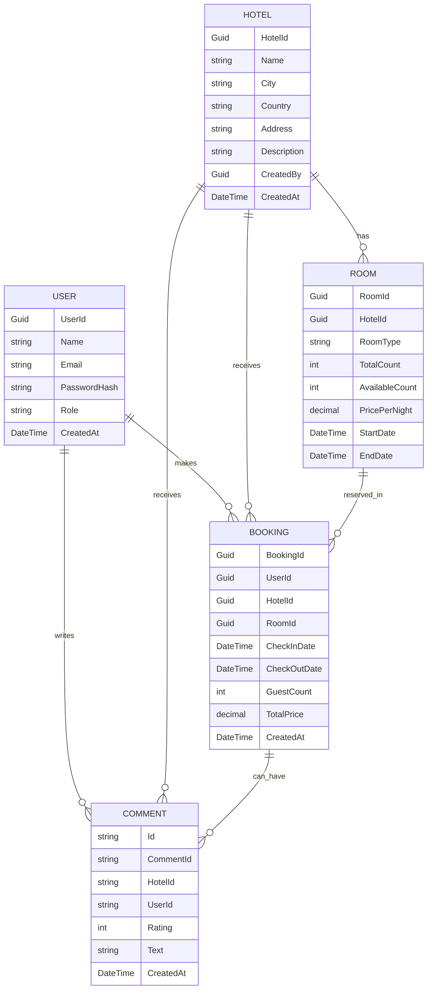

# Hotel Booking System

## Final Deployed URLs

- **API Gateway:** [https://hotelservicegateway.azurewebsites.net](https://hotelservicegateway.azurewebsites.net)
- **Main Hotel Booking Service:** [https://hotelbookingservice.azurewebsites.net](https://hotelbookingservice.azurewebsites.net)

## Project Overview

This project is a microservices-based Hotel Booking System built with ASP.NET Core. It consists of two main components:

- **HotelBookingSystem:** The main backend service handling hotel, room, booking, user, and comment management.
- **HotelBookingApiGateway:** An API Gateway using Ocelot to route requests to the backend service and provide a unified entry point.

### Main Features
- User registration and authentication (JWT-based)
- Hotel and room management
- Room booking with availability checks
- User comments and hotel ratings (stored in MongoDB)
- Admin and user roles
- Notification service (Azure Service Bus)
- Redis caching for hotel data
- OpenAPI/Swagger documentation

## Design, Assumptions, and Issues

### Design
- **Microservices Architecture:** The system is split into a core service and an API gateway for scalability and separation of concerns.
- **Database:** Uses SQL Server for main data (hotels, rooms, bookings, users) and MongoDB for comments.
- **Caching:** Redis is used to cache hotel data for performance.
- **Messaging:** Azure Service Bus is used for notifications.
- **Security:** JWT authentication with role-based access control.

### Assumptions
- Each room belongs to a single hotel.
- Bookings are only possible for available rooms and valid date ranges.
- Comments are only allowed by users who have booked a room in the hotel.
- Admins can manage all hotels, rooms, and bookings.

### Issues Encountered
- Integration of MongoDB for comments required custom context management.
- Ensuring consistency between SQL and NoSQL data sources.
- Handling distributed transactions and eventual consistency.
- Azure Service Bus configuration and local development setup.

## Data Models (ER Diagram)

## Project Presentation Video

- **Video Link:** [https://www.youtube.com/watch?v=8ybwxz-35zM](https://www.youtube.com/watch?v=8ybwxz-35zM)

---

